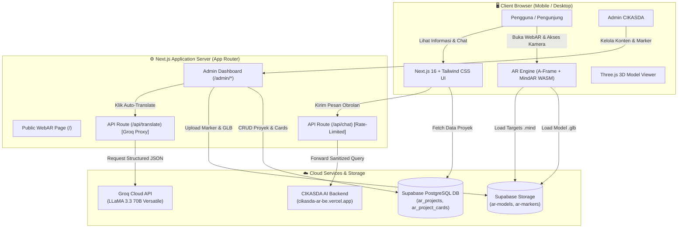
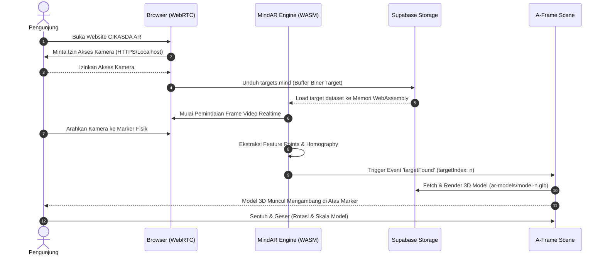

<div align="center">

# 🏛️ CIKASDA WebAR Platform
### Sistem Visualisasi Infrastruktur Berbasis Web Augmented Reality
**Dinas Cipta Karya & Sumber Daya Air Provinsi Sulawesi Tengah**

[](https://nextjs.org/)
[](https://react.dev/)
[](https://www.typescriptlang.org/)
[](https://tailwindcss.com/)
[](https://hiukim.github.io/mind-ar-js-doc/)
[](https://supabase.com/)
[](https://groq.com/)
[]()

<p align="center">
  Platform Augmented Reality (AR) modern berbasis web (WebAR) tanpa perlu instalasi aplikasi di perangkat pengguna. Dirancang untuk transparansi publik dan edukasi interaktif mengenai proyek infrastruktur strategis daerah di Sulawesi Tengah.
</p>

[Fitur Utama](#-fitur-utama) •
[Arsitektur Sistem](#-arsitektur-sistem) •
[Alur Kerja WebAR & Marker](#-alur-kerja-webar--marker-mindar) •
[Panduan Instalasi](#-panduan-instalasi--penggunaan) •
[Variabel Lingkungan](#-konfigurasi-environment-variables) •
[Admin Studio](#-admin-studio--cms) •
[Keamanan & Optimasi](#-keamanan-dan-optimasi-performa) •
[Troubleshooting](#-panduan-troubleshooting)

---

</div>

## 📌 Ringkasan Proyek

**CIKASDA WebAR** adalah platform Web Augmented Reality yang dikembangkan untuk Dinas Cipta Karya dan Sumber Daya Air (CIKASDA) Provinsi Sulawesi Tengah. Aplikasi ini mentransformasikan dokumen cetak, baliho, kartu identitas proyek, dan leaflet promosi menjadi pengalaman 3D interaktif yang hidup langsung melalui kamera browser smartphone (Safari, Chrome, Firefox) tanpa memerlukan aplikasi native dari Google Play Store atau Apple App Store.

Masyarakat dan pemangku kepentingan dapat memindai marker gambar fisik untuk melihat visualisasi miniatur 3D (seperti **Masjid Raya Baitul Khairaat**, **Bendungan Irigasi CIKASDA**, dan **Gedung Kantor & SPAM Terpadu**), memutar dan memperbesar model secara real-time dengan sentuhan gestur jari, membaca spesifikasi teknis bilingual, serta berinteraksi dengan asisten cerdas AI.

---

## ✨ Fitur Utama

### 📱 1. Zero-Install WebAR Scanner
- **Kamera Langsung di Browser**: Memanfaatkan standar WebRTC MediaStreams API dan WebAssembly (WASM).
- **Multiple Image Target Tracking**: Melacak multi-marker secara simultan dalam satu file terkompilasi (`targets.mind`).
- **Smooth Gesture Controls**:
  - *Satu Jari*: Rotasi model 3D pada sumbu X dan Y.
  - *Dua Jari (Pinch-to-Zoom)*: Skalasi dinamis ukuran model.
- **Hardware Power Management**: Stream kamera perangkat otomatis dihentikan secara bersih (`MediaStreamTrack.stop()`) saat komponen unmount untuk menghemat daya baterai.

### 🏛️ 2. Dynamic 3D Infrastructure Showcase
- **GLB / glTF 2.0 PBR Rendering**: Mendukung model 3D teroptimasi dengan material fisik realistis (PBR), bayangan, dan tekstur beresolusi tinggi.
- **Kartu Spesifikasi 4-Slot Interaktif**: Menampilkan data struktural lengkap (Bangunan Utama, Fungsi & Ibadah, Tahun Pembangunan, Lokasi/Koordinat, Kapasitas Debit, dll.) dengan modal pop-up detail.
- **State Persistence**: Mengingat model terakhir yang dipindai saat pengguna menggulir ke bawah membaca rincian proyek.

### 🌐 3. Sistem Lokalisasi Dwi-Bahasa (Bilingual ID / EN)
- Penggantian bahasa instan secara client-side antara **Bahasa Indonesia** dan **English**.
- Seluruh teks antarmuka, metadata proyek, dan kartu informasi secara mulus berganti tanpa reload halaman.

### 🤖 4. Asisten AI Cerdas Terintegrasi (CIKASDA Chatbot)
- Konsol obrolan interaktif yang terpasang langsung di bawah detail proyek.
- Mendukung pertanyaan cepat (*Quick Prompts*) dan konsultasi bebas seputar infrastruktur CIKASDA.
- Didukung backend AI proxy yang dilengkapi sistem **In-Memory IP Rate Limiting** untuk mencegah eksploitasi spam dan token exhaustion.

### 🛠️ 5. CIKASDA Admin Control Panel (CMS)
- **Manajemen Proyek Infrastruktur**: Tambah, edit, dan hapus data proyek lengkap dengan target index marker.
- **Auto-Translate AI (Groq LLaMA 3.3 70B)**: Menerjemahkan otomatis judul, kategori, deskripsi, dan 4 slot kartu dari Bahasa Indonesia ke Bahasa Inggris dalam format JSON terstruktur hanya dengan 1 klik (*Sparkle Translate*).
- **MindAR Marker Studio**: Mengompilasi gambar marker target langsung di browser menjadi file biner `.mind` menggunakan WASM Compiler dan mengunggahnya secara otomatis ke Supabase Storage.
- **3D GLB Studio**: Pratinjau model 3D interaktif berbasis Three.js/model-viewer sebelum dipublikasikan ke publik.

---

## 🏗️ Arsitektur Sistem

Platform ini dibangun menggunakan arsitektur modern berbasis micro-frontend & serverless services:



---

## 🎯 Alur Kerja WebAR & Marker (MindAR)



### Indeks Target Marker Bawaan:
| Target Index | Nama Proyek | Model GLB | Skala Optimal |
| :---: | :--- | :--- | :--- |
| **`0`** | Masjid Raya Baitul Khairaat | `ar-models/mosque.glb` | `0.1 0.1 0.1` |
| **`1`** | Bendungan Irigasi CIKASDA | `ar-models/bendungan.glb` | `0.05 0.05 0.05` |
| **`2`** | Gedung Dinas & SPAM Regional | `ar-models/cikasda.glb` | `0.2 0.2 0.2` |

---

## 💻 Tech Stack

| Kategori | Teknologi | Keterangan |
| :--- | :--- | :--- |
| **Core Framework** | [Next.js 16.3.0](https://nextjs.org/) | React Server Components, Turbopack, App Router |
| **Frontend Library** | [React 19.2.8](https://react.dev/) | Concurrent Mode, Hooks, Dynamic Imports |
| **Bahasa Pemrograman** | [TypeScript 5](https://www.typescriptlang.org/) | Type Safety penuh tanpa kompilasi `any` bebas |
| **Styling** | [Tailwind CSS v4](https://tailwindcss.com/) | Modern CSS-first configuration & micro-animations |
| **AR Engine** | [MindAR 1.2.5](https://github.com/hiukim/mind-ar-js) & [A-Frame 1.4.2](https://aframe.io/) | WebAssembly Computer Vision Image Target Tracking |
| **3D Rendering** | [Three.js](https://threejs.org/) | PBR shading, glTF / GLB loading |
| **Database & Auth** | [Supabase SSR](https://supabase.com/) | PostgreSQL, Row Level Security, Auth Session |
| **Object Storage** | Supabase Storage | Bucket `ar-models` (GLB) & `ar-markers` (.mind & PNG) |
| **AI LLM Engine** | [Groq LLaMA 3.3 70B](https://groq.com/) | Pemrosesan bahasa alami & translasi dwi-bahasa |
| **State & Fetching** | [SWR 2.5.1](https://swr.vercel.app/) | Client cache, optimistic UI, auto revalidation |
| **Ikonografi** | [Lucide React](https://lucide.dev/) | Set ikon modern dan konsisten |
| **Package Manager** | [pnpm](https://pnpm.io/) | Cepat, efisien disk, deterministik |

---

## 🚀 Panduan Instalasi & Penggunaan

### 1. Prasyarat Sistem
- **Node.js**: Versi `18.18.0` atau `>= 20.0.0`
- **pnpm**: Versi `>= 9.0.0` (Gunakan `npm install -g pnpm` jika belum terpasang)
- **Webcam / Smartphone**: Kamera yang berfungsi dengan browser berstandar WebRTC (Chrome / Safari)

### 2. Kloning Repositori
```bash
git clone https://github.com/qillaqil/Cikasda_AR_fe.git
cd Cikasda_AR_fe
```

### 3. Instalasi Dependensi
```bash
pnpm install
```

### 4. Konfigurasi Environment Variables
Salin file `.env.example` ke `.env.local`:
```bash
cp .env.example .env.local
```
Buka file `.env.local` dan isi parameter yang dibutuhkan (lihat detail pada bagian [Environment Variables](#-konfigurasi-environment-variables)).

### 5. Menjalankan Server Pengembangan
```bash
pnpm dev
```
Buka browser dan navigasikan ke:
- **WebAR Publik**: [http://localhost:3000](http://localhost:3000)
- **Admin Studio**: [http://localhost:3000/admin](http://localhost:3000/admin)

> [!IMPORTANT]
> **Penting untuk Pengujian WebAR di Smartphone:**
> Browser mobile (iOS Safari / Android Chrome) mewajibkan **koneksi HTTPS** atau domain `localhost` untuk membuka kamera.
> Untuk melakukan pengujian langsung di smartphone Anda dalam jaringan lokal yang sama, gunakan tunneling HTTPS seperti:
> ```bash
> npx localtunnel --port 3000
> # atau
> npx ngrok http 3000
> ```

### 6. Build untuk Produksi
```bash
# Validasi TypeScript
pnpm exec tsc --noEmit

# Build bundle produksi Next.js
pnpm build

# Jalankan server produksi
pnpm start
```

---

## 🔑 Konfigurasi Environment Variables

File konfigurasi berada pada `.env.local`:

| Nama Variabel | Sifat | Deskripsi | Contoh Nilai |
| :--- | :---: | :--- | :--- |
| `NEXT_PUBLIC_SUPABASE_URL` | **Publik** | URL API project Supabase Anda | `https://xyz.supabase.co` |
| `NEXT_PUBLIC_SUPABASE_ANON_KEY` | **Publik** | Public Anon API Key Supabase | `eyJhbGciOiJIUzI1NiIs...` |
| `NEXT_PUBLIC_SUPABASE_PUBLISHABLE_KEY` | **Publik** | Publishable key format baru (opsional) | `sb_publishable_...` |
| `SUPABASE_SERVICE_ROLE_KEY` | **Rahasia** | Service role key untuk bypass RLS di backend | `eyJhbGciOi...` |
| `CHAT_API_URL` | **Rahasia** | Endpoint backend AI Chatbot CIKASDA | `https://cikasda-ar-be.vercel.app/api/chat` |
| `GROQ_API_KEY` | **Rahasia** | API Key Groq untuk fitur auto-translate LLaMA | `gsk_...` |
| `NEXT_PUBLIC_APP_URL` | **Publik** | Base URL aplikasi untuk metadata SEO | `https://cikasda.sultengprov.go.id` |

---

## 🗄️ Skema Database & Storage Supabase

### 1. Struktur Tabel PostgreSQL
```sql
-- Tabel Proyek Infrastruktur
create table public.ar_projects (
  id uuid primary key default gen_random_uuid(),
  target_index integer not null unique,
  slug text not null unique,
  title_id text not null,
  title_en text not null,
  category_id text not null,
  category_en text not null,
  description_id text not null,
  description_en text not null,
  model_url text not null,
  model_scale text default '0.1 0.1 0.1',
  marker_image_url text not null,
  is_active boolean default true,
  created_at timestamp with time zone default now()
);

-- Tabel 4 Kartu Spesifikasi Proyek
create table public.ar_project_cards (
  id uuid primary key default gen_random_uuid(),
  project_id uuid references public.ar_projects(id) on delete cascade,
  slot_index integer not null check (slot_index between 0 and 3),
  icon_name text not null default 'Building2',
  label_id text not null,
  label_en text not null,
  value_id text not null,
  value_en text not null,
  detail_id text not null,
  detail_en text not null,
  created_at timestamp with time zone default now(),
  unique(project_id, slot_index)
);

-- Tabel Riwayat Kompilasi MindAR
create table public.mindar_bundles (
  id uuid primary key default gen_random_uuid(),
  bundle_url text not null,
  total_targets integer not null,
  is_active boolean default true,
  created_at timestamp with time zone default now()
);
```

### 2. Storage Buckets
Pastikan policy bucket diatur ke **Public Read**:
- `ar-models`: Menyimpan file 3D format `.glb`
- `ar-markers`: Menyimpan file gambar `.png`/`.jpg` dan biner terkompilasi `targets.mind`

---

## 🔒 Keamanan dan Optimasi Performa

1. **Abstraksi Storage Supabase Tanpa Kebocoran Kredensial**:
   - URL file publik diakses melalui helper terpusat `getPublicStorageUrl(bucket, path)` di [src/lib/supabase/client.ts](src/lib/supabase/client.ts).
   - Menghilangkan hardcode URL mentah di seluruh komponen aplikasi sehingga pergantian instance Supabase cukup dilakukan di satu file `.env.local`.
   - File storage publik hanya berisikan aset visual (GLB & gambar) tanpa menyimpan data kredensial atau rahasia apa pun.
2. **In-Memory IP Rate Limiting & DoS Protection**:
   - Endpoint `/api/chat` membatasi maksimal 5 permintaan per menit per IP.
   - Endpoint `/api/translate` membatasi maksimal 10 permintaan per menit per IP.
   - Peta penyimpanan IP dibatasi maksimal 1.000 entri dan dibersihkan berkala secara otomatis untuk mencegah serangan kehabisan memori (*memory-exhaustion DoS*).
3. **Payload Sanitization & Timeouts**:
   - Pembatasan panjang karakter pesan (maks 1.000 karakter pada pesan chat, maks 3.000 karakter pada deskripsi proyek).
   - Pemanggilan API upstream diproteksi dengan `AbortSignal.timeout(15000)` agar koneksi server tidak menggantung jika terjadi kelambatan jaringan.
4. **Hardware Lifecycle Sanitation**:
   - Integrasi MindAR dilengkapi listener `MutationObserver` dan fungsi pembersih unmount yang otomatis mematikan hardware kamera saat pengguna berpindah halaman.

---

## 🛠️ Panduan Troubleshooting

| Gejala Masalah | Penyebab Umum | Solusi yang Diterapkan |
| :--- | :--- | :--- |
| **Layar Kamera Hitam/Gelap** | Video WebRTC MindAR tertimpa oleh *layer stacking* elemen container berlatar belakang hitam (`bg-black`). | Pastikan container AR memiliki kelas `bg-transparent` dan elemen `<video>` MindAR disetel ke `z-index: 1`, sedangkan elemen `<a-scene>` disetel ke `z-index: 2`. |
| **Model 3D Tidak Muncul saat Marker Discan** | File `targets.mind` tidak cocok dengan marker, atau terjadi *race condition* inisialisasi `<a-scene>` saat scripts belum selesai dimuat. | Gunakan sistem penundaan `scriptsReady` sebelum me-render scene, pastikan parameter `mindar-image="autoStart: true"` aktif, dan hubungkan indeks target dengan atribut `mindar-image-target="targetIndex: n"`. |
| **Izin Kamera Ditolak (`VIDEO_FAIL`)** | Browser dijalankan di protokol non-aman (HTTP biasa) pada remote device atau terdapat tab lain yang mengunci kamera. | Gunakan koneksi `HTTPS` atau tunnel `ngrok/localtunnel`, dan pastikan tidak ada proses/komponen lain yang memanggil `navigator.mediaDevices.getUserMedia` secara bersamaan. |
| **Model 3D Berat / Macet saat Diunduh** | Ukuran file GLB terlalu besar untuk jaringan seluler. | Optimasi model 3D menggunakan tool seperti [glTF-Pipeline](https://github.com/CesiumGS/gltf-pipeline) atau Draco compression agar ukuran tiap model berada di bawah 5MB - 10MB. |

---

## 👥 Pengembang & Kontributor

Dikembangkan dengan dedikasi untuk:
- **Dinas Cipta Karya dan Sumber Daya Air (CIKASDA) Provinsi Sulawesi Tengah**
- Tim Pengembang Magang CIKASDA WebAR Project 2025/2026

---

<div align="center">
  <sub>Hak Cipta © 2026 Dinas Cipta Karya & Sumber Daya Air Provinsi Sulawesi Tengah. Hak Cipta Dilindungi Undang-Undang.</sub>
</div>
